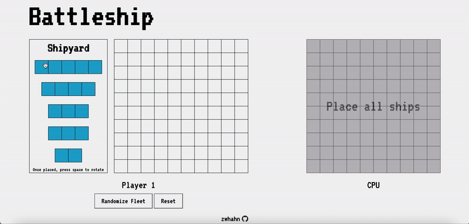
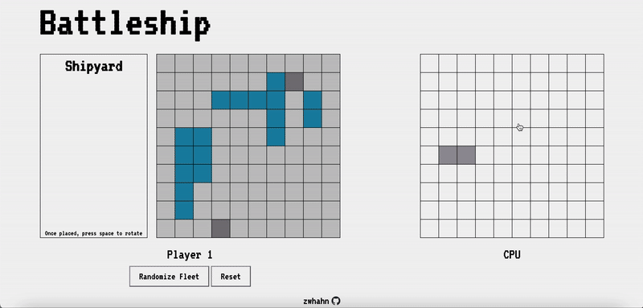

# Battleship

Interactive battleship game with 0 dependencies built with pure JavaScript. It was completed as part of [The Odin Project](https://www.theodinproject.com/about).

This project was completed following test-driven development (TDD) philosophy and using the Jest test-running symptom. It features drag-and-drop ship placement, random placement, and intellegent computer guesses.

**[Live Preview](https://zwhahn.github.io/battleship/)**

## Preview

#### Drag-and-Drop Ship Placement



#### Intellegent computer guessing



## Getting Started

```
git clone https://github.com/zwhahn/battleship.git
cd battleship
npm install

# To run tests
npm test
```

## Future Developmet

- Two player mode
- Computer difficulty levels
- "Shadowing" where ship will be dropped
